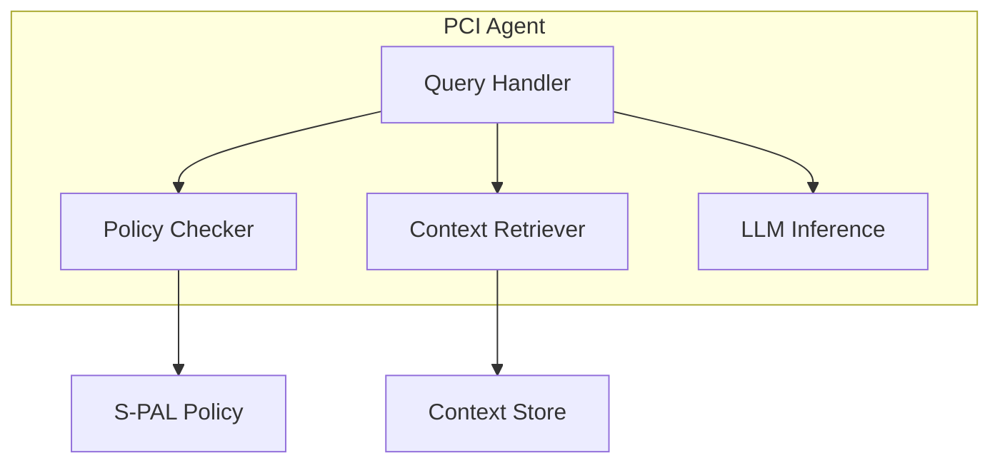

# PCI Agent

Layer 2: Local AI agent for Personal Context Infrastructure.

## Overview

The PCI Agent provides:

- **Local AI Processing** - Run language models on your device
- **Context Retrieval** - Query encrypted context store
- **Policy Enforcement** - Validate requests against S-PAL policies
- **Decision Support** - AI-powered assistance without data leakage

## Installation

```bash
# Using uv
uv pip install pci-agent

# With LLM support
uv pip install "pci-agent[llm]"
```

## Quick Start

```python
from pci_agent import Agent, AgentConfig

# Initialize agent
agent = Agent(AgentConfig(
    model_path="models/phi-3-mini-q4.gguf",
))

# Process a request with policy enforcement
response = await agent.process(
    query="What are my upcoming appointments?",
    policy_id="calendar-access",
)

print(response.content)
```

## Architecture



## Supported Models

The agent works with GGUF-format models:

| Model | Parameters | RAM Required | Quality |
|-------|------------|--------------|---------|
| Phi-3 Mini | 3.8B | 4GB | Good |
| Llama 3.2 | 3B | 3GB | Good |
| Mistral | 7B | 8GB | Better |
| Llama 3.1 | 8B | 10GB | Best |

## Development

```bash
# Install dev dependencies
uv pip install -e ".[dev]"

# Run tests
pytest

# Type check
mypy src/

# Lint
ruff check src/
```

## Related Packages

- [pci-spec](https://github.com/peteski22/pci-spec) - S-PAL schema and protocols
- [pci-context-store](https://github.com/peteski22/pci-context-store) - Layer 1: Context Store
- [pci-contracts](https://github.com/peteski22/pci-contracts) - Layer 3: Smart Contracts
- [pci-zkp](https://github.com/peteski22/pci-zkp) - Layer 4: Zero-Knowledge Proofs

## License

Apache 2.0
