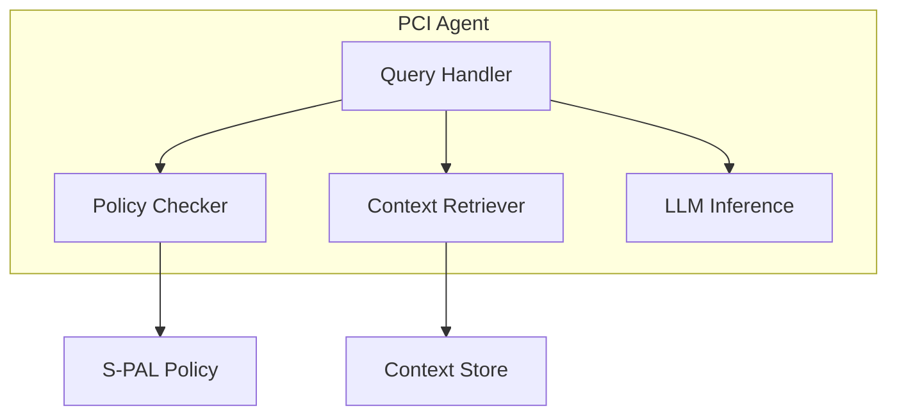

# PCI Agent

Layer 2: Local AI agent for Personal Context Infrastructure.

## Overview

The PCI Agent provides:

- **Local AI Processing** - Run language models on your device
- **Context Retrieval** - Query encrypted context store
- **Policy Enforcement** - Validate requests against S-PAL policies
- **Decision Support** - AI-powered assistance without data leakage

## Installation

```bash
# Clone and install
git clone https://github.com/peteski22/pci-agent.git
cd pci-agent
uv sync

# With LLM support (llama-cpp-python)
uv sync --extra llm
```

## Quick Start

```python
from pci_agent import Agent, AgentConfig

# Initialize agent
agent = Agent(AgentConfig(
    model_path="models/phi-3-mini-q4.gguf",
))

# Process a request with policy enforcement
response = await agent.process(
    query="What are my upcoming appointments?",
    policy_id="calendar-access",
)

print(response.content)
```

## Architecture



## Supported Models

The agent works with GGUF-format models:

| Model | Parameters | RAM Required | Quality |
|-------|------------|--------------|---------|
| Phi-3 Mini | 3.8B | 4GB | Good |
| Llama 3.2 | 3B | 3GB | Good |
| Mistral | 7B | 8GB | Better |
| Llama 3.1 | 8B | 10GB | Best |

## Local Inference

Two backends are supported behind a single protocol:

- **Ollama** (recommended) — talks HTTP to a local `ollama serve` daemon
  (default `http://127.0.0.1:11434`). Cross-platform, transparent MLX on
  Apple Silicon, and supports JSON-schema constrained output via Ollama's
  `format` parameter — used by the S-PAL flow to synthesise validated
  `RequestContext` proposals.
- **llama-cpp-python** (in-process, "no daemon") — kept as a fallback for
  single-executable demos. Requires the optional `llm` extra:
  `uv sync --extra llm`.

Named model tiers (Ollama backend):

| Tier | Model tag | Notes |
|---|---|---|
| `default` | `qwen3.6:27b` | Primary tier for laptop / dev boxes with 16+ GB. |
| `small` | `phi4-mini:3.8b` | Emergency fallback for <=8 GB RAM boxes. |

pci-agent targets desktop and server runtimes; the mobile / on-device story lives in a separate native client (see ADR-006 in `pci-docs`). This release does not expose an `on-device` tier — Bonsai-27B and similar Q1_0 models depend on `llama.cpp` backend support that isn't yet wired into every Ollama build (see [ollama/ollama#15359](https://github.com/ollama/ollama/issues/15359) for tracking).

Basic usage:

```python
from pci_agent import Agent, AgentConfig, LLMConfig

agent = Agent(AgentConfig(llm=LLMConfig(backend="ollama", ollama_tier="default")))
await agent.initialize()
try:
    # S-PAL wiring: synthesise a RequestContext for the policy checker
    request_ctx = await agent.propose_request_context(
        "Business wants age >= 18 verification for alcohol purchase."
    )
finally:
    await agent.close()
```

Integration smoke tests against a live Ollama daemon:

```bash
ollama pull phi4-mini:3.8b
PCI_OLLAMA_MODEL=phi4-mini:3.8b uv run pytest -m ollama
```

## Environment Variables

| Variable | Default | Description |
|----------|---------|-------------|
| `PORT` | `8082` | HTTP server port |
| `ZKP_SERVICE_URL` | `http://localhost:8084` | ZKP service endpoint |
| `PCI_APPROVAL_MODE` | `manual` | Autonomous approval mode: `manual`, `auto_with_notification`, or `fully_autonomous` |
| `CARDANO_API_URL` | `http://localhost:8080` | Cardano devnet API endpoint |
| `PCI_LLM_BACKEND` | `llamacpp` | `ollama` or `llamacpp` |
| `PCI_LLM_TIER` | `default` | `default` (Qwen3.6-27B) or `small` (Phi-4-mini) |
| `PCI_OLLAMA_URL` | `http://127.0.0.1:11434` | Ollama daemon base URL |
| `PCI_OLLAMA_MODEL` | _(from tier)_ | Explicit Ollama model tag override |
| `PCI_OLLAMA_TIMEOUT` | `120.0` | Per-request HTTP timeout (seconds) |
| `PCI_LLM_MODEL_PATH` | _(unset)_ | GGUF path for the llama-cpp backend |

## Development

```bash
# Install with dev dependencies
uv sync --group dev

# Run tests
uv run pytest

# Type check
uv run mypy src/

# Lint
uv run ruff check src/

# Run the agent
uv run python -m pci_agent
```

## Related Packages

- [pci-spec](https://github.com/peteski22/pci-spec) - S-PAL schema and protocols
- [pci-context-store](https://github.com/peteski22/pci-context-store) - Layer 1: Context Store
- [pci-contracts](https://github.com/peteski22/pci-contracts) - Layer 3: Smart Contracts
- [pci-zkp](https://github.com/peteski22/pci-zkp) - Layer 4: Zero-Knowledge Proofs
- [pci-identity](https://github.com/peteski22/pci-identity) - Layer 5: DID Management

## License

Apache 2.0
